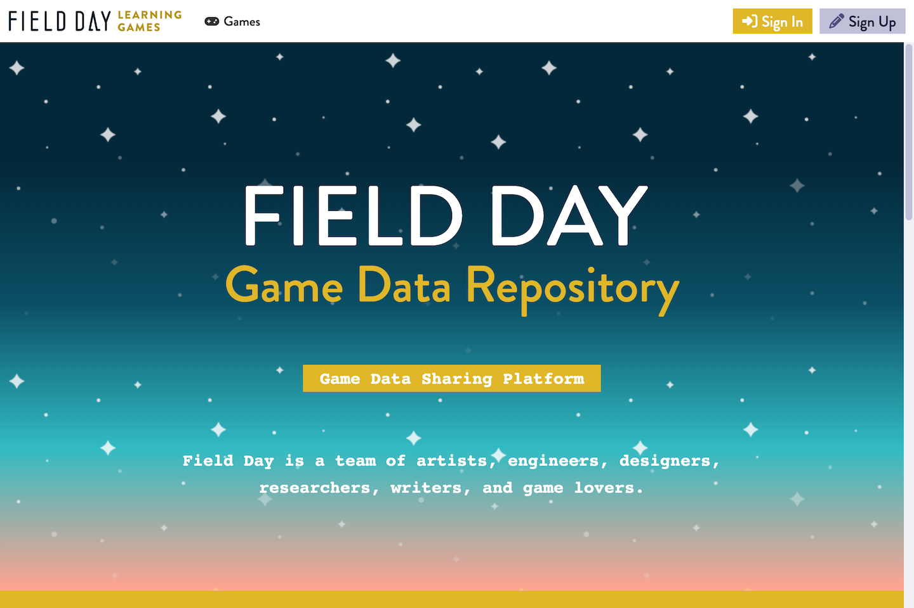
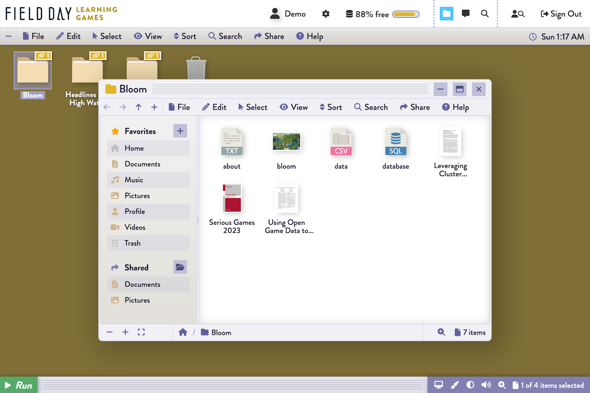

	

# Field Day Game Data Repository

The Field Day Game Data Repository is a cloud-based file storage, management, and sharing system that is used to share data from the games created by the [Field Day Lab](https://fielddaylab.wisc.edu).

*Welcome Screen*

This is the initial view that you see when viewing the web application.

*Games*

This view allows you to view data from a selection of games.

*Upload New Game Data*

This view allows you to review, manage, and upload data for each of the games in the repository.  You must have created an account and have signed in to the application in order to see this view.

## Live Demo

You can explore the features and benefits of the platform at [https://fielddaylab.services.dsi.wisc.edu](https://fielddaylab.services.dsi.wisc.edu).

## Installation

Please follow the instructions in [https://fielddaylab.services.dsi.wisc.edu/#installation](https://fielddaylab.services.dsi.wisc.edu/#installation) to install the software on your computer or web server.

## Instructions

See the [User Guide](https://fielddaylab.services.dsi.wisc.edu/#help) for instructions on how to use the platform.

## License

Distributed under the MIT License. See [LICENSE](LICENSE) for more information.

## Contact

mailto:amegahed@wisc.edu
